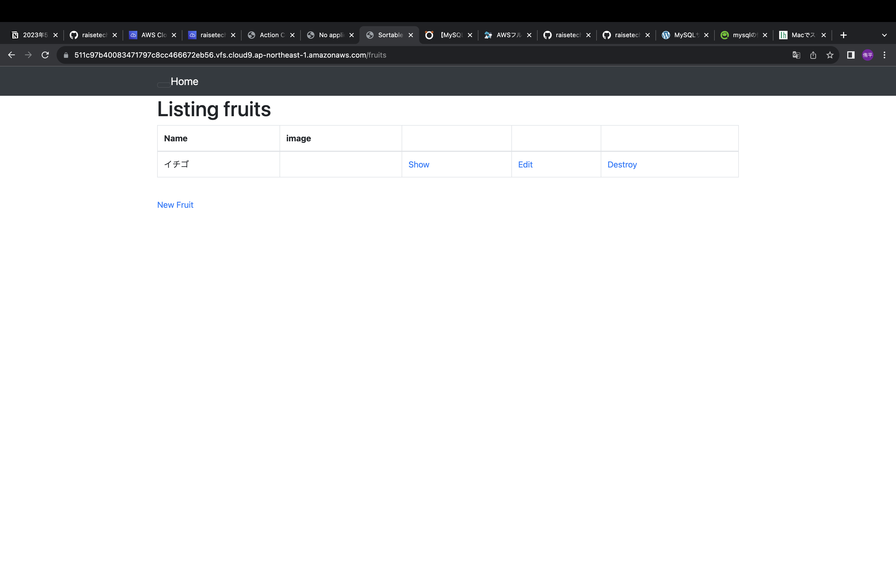

## Raise tech第3回課題

- サンプルアプリケーション起動
  
　　

- APサーバー　puma ver.5.6.5
- APサーバー停止するとアクセス不可
　
　

- DBサーバーMySQL ver. 8.0.34
- DBサーバー停止するとアクセス不可

  

- Rails 構成管理ツール　bundler

### 学習した事

- WEBアプリケーションはWEBブラウザ上で利用できるアプリケーション
- WEBアプリケーションの仕組み（APサーバー、DBサーバーなどの役割）
- Ruby on railsによるWEBアプリケーションの起動
- 外部ライブラリ、構成管理ツールの重要性など

### 感想

- 今回の第３回講義も初めての事だらけでエラーなどもあり時間がかかった。
エラーも多かったがその分学習できてよかった。

